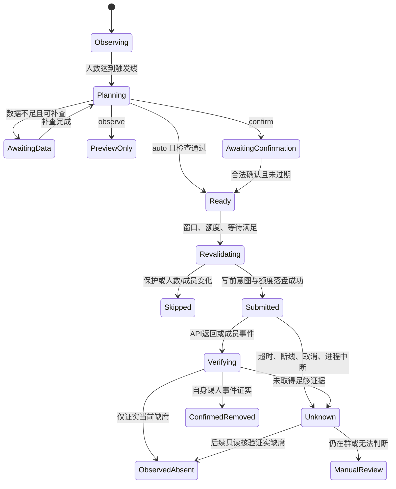

# 工程实现与验收计划

日期：2026-09-21。状态：设计阶段。本次仓库提交不包含运行入口和踢人逻辑。

## 1. 代码边界与模块

沿用既有 AstrBot 插件的 `main.py + 包目录 + metadata.yaml + _conf_schema.json + tests/` 结构；运行代码在后续实施时加入，避免把设计仓库伪装为已可用版本。

```text
main.py                         注册、生命周期、事件与私聊命令
qq_group_cleaner/
  config.py                     类型校验、继承、预设与不可变策略编译
  models.py                     策略、三值数据、成员代次、计划和结果
  platform.py                   唯一 OneBot 入口、账号路由、超时与错误分类
  capabilities.py               版本指纹、字段健康、只读诊断
  activity.py                   活动时间、每日计数、覆盖缺口、消息去重
  rules.py                      保护、候选、排序、解释，不执行 I/O
  planner.py                    容量周期、数据补充、计划生成和确认
  scheduler.py                  多群公平调度、窗口、暂停与配额
  executor.py                   复查、写前落盘、单人成员移出、结果核对
  pacing.py                     共享 guard 兼容层和本插件账号限制
  store.py                      SQLite 事务、迁移、租约、保留任务
  notifier.py                   私聊批摘要、去重、预算与离线合并
  logging_setup.py              专属日志文件、轮转和错误摘要
tests/                          纯规则、适配器、并发、恢复、权限和故障注入
```

`rules.py` 是纯函数：输入版本化的策略和带数据来源的成员快照，输出保护/候选/数据不足及理由。预览、确认、自动执行共用，不维护两套筛选逻辑。涉及消息正文的 LLM 处理不在本插件路径中。

## 2. 数据模型与最小存储

使用 AstrBot 的插件数据目录，文件布局：

```text
data/plugin_data/astrbot_plugin_qq_group_cleaner/
  state.sqlite3
  instance.lock
  logs/cleaner.log
  logs/cleaner.log.1 ... cleaner.log.7
  exports/                         临时授权导出
```

核心表：

| 表 | 必需内容 |
| --- | --- |
| policies | 标识、配置修订、编译摘要、账号群绑定 |
| memberships | platform/self/group/user、membership_epoch、入群来源、是否在群、首次见到、最近核验 |
| member_facts | 数据值、source、observed_at、有效性和失效原因；不是只存裸整数 |
| activity_daily | 成员代次、日期、实际收到的消息数和活动时间；不保存聊天正文 |
| seen_events | 有界的去重指纹与到期时间，不能因重复上报累加条数 |
| coverage_intervals | 账号/群监听的健康区间、掉线、停用、队列丢失、时钟异常 |
| exemptions | 临时/永久保护、来源、期限、操作者、变更记录 |
| cleanup_cycles | 触发时人数、目标、创建/到期时间、状态 |
| plans / plan_members | 规则版本、快照、排序、名单、理由、确认人/到期、状态 |
| operations | 写前意图、成员代次、操作状态、错误类别、平台响应与核验摘要 |
| quota_reservations | 账号/群滚动额度、提交时间、撤销前置预留，不按重启清零 |
| runtime_state | 下一批时间、暂停原因、恢复时间、调度游标 |
| audit_events | 配置、权限、计划、执行、暂停/恢复的结构化事件 |

成员身份键包含 `(platform_id, self_id, group_id, user_id, membership_epoch)`。同一个 QQ 退出再加入必须产生新代次，旧计划失效。只有入群时间而无实时事件时也要对比时间变化；不能区分是否重入时按身份未知保护，避免清理刚回群的人。

UTC 存储事件与截止时间；展示和执行窗口使用群时区。等待用单调时钟，持久额度用 UTC；检测系统时间倒退或大幅跳变时暂停写入调度并要求重新校时，不能借改系统时间重置24小时额度。

SQLite 使用单写入队列、短事务、外键、唯一约束、`busy_timeout`，优先 WAL；Windows 文件系统上实际验证锁与 fsync 语义。数据库写入放在线程或异步驱动中，不能阻塞 AstrBot 事件循环。规则执行不在 SQL 事务内等待网络。

## 3. 采集与能力判断

### 3.1 事件路径

注册高优先级轻量事件处理器，核对账号、群、actor、时间；仅观察，不 `stop_event()`、不主动触发 LLM、不自动回复群消息。原始事件转成最小结构后写入有界队列，及时刷新活动最大时间并合并日报计数。

同一成员事件重复去重；乱序时间取 `max`，不能让旧消息覆盖近期活动。过于未来、负数、毫秒/秒混淆标为异常；只接受已确认单位的字段，不盲目除1000。超长昵称和错误信息截断，控制字符转义。

队列满时不能无声丢失后继续依赖“没消息”的结论：标记该群覆盖缺口，停止依赖本地负面活动证据的自动执行。写前必须等待此前已接收事件落盘，或使用内存近期活动保护并确认持久化健康。事件写入失败则暂停执行。

本地累计为0不能证明没有发言。消息过滤的完整性无法靠一条测试消息完全证明；若目标会话启用了已知会截断事件的框架设置，禁用基于本地沉默/低条数的自动规则，保留观察和平台可信发言时间路径。后续框架设置变化需重新评估能力。

### 3.2 只读接口路径

所有读取走统一调度和预算：人数轻量检查 → 达阈值才取成员表 → 本地初筛 → 必要候选/保护等级按需补查 → 执行前复核。不得扫描所有群或每分钟遍历全员详细资料。

`get_status`/桥接状态可合并短缓存，但网络读取失败时不能靠缓存在线标志继续踢人。`get_group_info` 和成员列表有缓存限制，详见能力核验文档。`get_group_detail_info` 用于执行前人数核对；成员表仍须多源一致性检查。

读取失败指数退避并有最大次数；确认读失败会阻止后续写。HTTP 成功不等于 OneBot 成功，必须解析 status、retcode 和形状；错误文本只辅助分类，不把任意包含“not found”的错误当作人已离群。

清理依据中不能把值缺失变成0：尤其 `qq_level`、`level`、`last_sent_time`。字段失效比例按本次策略真正依赖的字段计算；未使用的 QQ 等级全0不影响仅按可信发言时间的观察。

### 3.3 数据新鲜度

执行前对 bot 与目标角色、目标入群代次和关键条件做单人核对；bot 角色可以在批内有短缓存，但管理员变更事件或任何权限异常立即使缓存失效。目标角色在每次写前读取，不沿用30分钟旧名单。

列表完整性、数据时间或人数对不上时，短暂等待、受限次数重新读取；仍不一致则本群暂停。快照无版本号意味着无法证明完全无竞态，应标为 best-effort 复核；在这种边界下优先保留成员。

## 4. 调度、互斥和账号频率

一个账号只能同时执行一个本插件网络任务，群之间轮转调度，不能让大群无限占据队列。优先级：紧急暂停状态落盘 > 未知操作只读核对 > 执行前必要核验 > 计划与人数检查 > 资料补查 > 普通通知。任何优先级都不能绕过额度。

长等待不持有数据库事务和全局调度锁。持久化每项 `not_before` 时间，按到期唤醒；随机数仅在创建预约时抽取一次，重启不能重新抽成更短时间。进入真正写操作的最后临界区后才取得账号写锁并复查。

在现有环境中兼容 `_qq_automation_guard_v1` 的 `run` 协议：

- 现有两个插件实际以 `platform_id` 作为 v1 调度键，并非严格以 QQ 号为键。接入时使用相同 platform_id 复用 platform manager 上已有对象，不替换、不猴子补丁；本插件自己的额度另外按 self_id 汇总。
- 本插件另有更严格的群/账号配额和持久化操作状态，不把 guard 的短期去重当唯一防重复机制。
- v1 把 API 不抛错当成功，不能用其 success 代表成员已移出；executor 的核验状态才是业务事实。
- 不能声称本插件30秒间隔会自动改变旧插件对自身动作使用的8秒间隔。v1 只能提供串行与已预留 next_at；统一的全插件限额需要三个插件共同升级协议，列为后续协调工作。
- 同一 QQ 通过多个 platform_id 接入时，旧插件的 v1 锁不会跨这些平台串行。首版应检测本机重复账号绑定并阻止自动执行，提示保留一个执行平台；不同主机的重复绑定仍属于无法可靠探测的部署边界。
- shared_guard=required 且不存在兼容对象时禁用执行；auto 无对象时本插件独立调度并明确展示“只覆盖本插件”。检测到未知版本对象则暂停，不能偷偷创建另一把锁。
- 现有 v1 长时间 sleep 持锁的限制通过本插件先等长准备期、仅短间隔进入 guard 减轻；不在此仓库单独修改旧插件的锁代码。

进程级使用插件数据目录锁，阻止同一目录多执行器；数据库租约和 fencing generation 防同进程重载前后双调度。多个进程或主机分别使用不同数据目录无法被这个锁可靠发现，首版不支持这种部署对同一个 QQ 自动操作，管理员须保证单执行实例；不能宣传跨主机互斥。

额度按“实际提交的踢人尝试”记账：提交前事务预留，明确尚未提交的取消可释放；请求已发送后，无论成功/失败/超时都占额度。未知记录不会因额度窗口过期失去防重状态。

每次写前验证仍在执行窗口，窗口关闭则保存等待；跨午夜和夏令时使用时区库处理，重复时段不能重复执行。手动确认也遵守窗口、额度和延迟，不提供绕过参数。

## 5. 计划与操作状态机



任一尚未提交状态都能 Cancelled/Expired/Paused；图中省略这些边，但实现必须有明确状态迁移表与唯一提交约束。

### 写前流程

1. 读取当前启用策略和暂停标志，检查计划修订/账号绑定/到期、模式和确认人。
2. 检查成员代次、角色、保护、最新活动、数据来源和人数；不足目标则关闭周期。
3. 检查账号在线、执行窗口、群/账号预算。对比成员数据版本，期间有活动事件就跳过。
4. 在短事务中预留额度、写入唯一操作意图和提交状态，审计失败立即停止。
5. 在已获账号锁的临界区再次检查内存暂停和新活动标记，然后提交一个 `set_group_kick(reject_add_request=false)`。
6. 无论响应怎样都进入明确的核验或未知路径，不在 except 中直接重试踢人。

步骤4后进程退出但请求未真正发出的情况也可能被保守记录 unknown；宁可留待核对，不靠猜测补发。

### 未知结果处置

未知操作立即暂停该群后续移出，防止连续误判。默认等待事件10秒，再最多两次只读核对（有抖动、有额度）。

- 收到匹配当前代次、actor 为本 bot 的踢人通知：confirmed_removed。
- 只有可靠新名单证实缺席：observed_absent，原因不归功于本插件，不重复执行。
- 仍在群：标记待人工核对，不因为“仍在群”就重发；首次请求可能延迟生效。
- 明确未发送（连接检查前拒绝、配额不足）：deferred，可在下一次有效计划重试。
- 明确权限错误：failed，暂停并重新验证权限，不继续尝试其他成员。

OneBot 没有通用幂等键或“条件满足才踢”的原子接口，因此不能保证跨网络故障的 exactly-once。设计提供写前留痕和未知不重试；计划ID不是腾讯服务端幂等键。

## 6. 异常分类和恢复

| 异常 | 行为 | 恢复条件 |
| --- | --- | --- |
| QQ 离线 / KickedOffLine | 立即暂停账号写操作和高成本读取，失效旧计划 | 普通网络恢复后等待300～900秒并只读探测；明确踢下线要求管理员恢复 |
| 桥接断开、10054 | 标记连接错误；已提交操作 unknown，禁止认定为风控原因 | 恢复后重新核验，不自动登录 |
| 没有管理权限/被降权 | 暂停该群，普通成员永远不尝试踢管理员 | 权限恢复并重新生成计划 |
| 成员不存在/UID解析异常 | 不直接当成功；核对缓存、成员代次 | 多源证据证实缺席或人工处置 |
| 成员刚发言/重入/获得保护 | 跳过该候选，记录原因，不补入别人 | 下次独立计划重新评估 |
| QQ返回频繁/受限/异常操作 | 暂停账号写操作，记录实际错误 | 人工检查与恢复，不试探“安全阈值” |
| 连续一般读取异常 | 指数退避，达到阈值暂停一小时 | 冷却后只读探测通过 |
| 数据全0/大量缺失/名单人数冲突 | 暂停受影响策略 | 数据恢复或管理员显式修改依赖条件 |
| 数据库锁/损坏/磁盘满 | 所有踢人停止；不创建空数据库绕过问题 | 人工修复并完成一致性检查 |
| 日志写入或轮转失败 | 记录宿主摘要并暂停自动执行 | 日志恢复且审计健康；不能静默丢日志继续 |
| 配置非法或迁移失败 | 暂停对应范围，定位字段 | 合法配置重新加载 |
| 进程崩溃/插件重载 | 恢复额度、暂停、unknown和覆盖缺口 | 先核对提交中操作，再允许新计划 |
| 通知失败 | 本地状态可查，合并错误；不重放大量旧通知 | 在线后最多一条摘要或管理员主动查询 |
| 时钟异常 | 暂停依赖时间的写入判断 | 校时和计划重建 |

## 7. 日志轮转和审计保留

### 7.1 两类记录

运行日志用于查调度、接口失败和健康状态；结构化审计是计划和操作事实来源。日志删旧文件不删除未决操作，审计保留期不改变滚动额度或永久保护。

每条操作日志包含 UTC时间、级别、policy_id、plan_id、operation_id、状态、错误类别和耗时。默认账号/成员QQ脱敏，授权数据库详情保留必要标识。禁止记录 token、Authorization、WebUI URL内凭证、完整成员接口响应、聊天正文。

### 7.2 文件轮转

插件专属 logger，不改 AstrBot 根 logger 或 NapCat logger。以大小轮转：活动文件 `cleaner.log` 达10 MiB前切换，保留 `.1` 到 `.7`；正常上限约80 MiB（活动文件+7个归档），单条日志先限长到8 KiB，允许至多单条记录的边界误差。

同时每日清理超过14天的归档；大小、数量、年龄同时约束。DEBUG 默认与主文件同管线，但临时调试附加文件若启用只保留3天，仍使用有界大小，不新增无限日志目录。

使用单写线程/队列处理，轮转关闭旧句柄再改名，兼容 Windows；重载时 flush、close、remove 旧 handler，重复加载不能叠加 handler。因外部占用重命名失败时暂停文件写入并向宿主发一次摘要，不用另建无限文件绕过轮转。

相同异常默认5分钟只输出首次完整堆栈和后续次数摘要，不能每秒刷堆栈。队列本身有上限，溢出标记健康异常并阻止自动执行。

### 7.3 数据保留与容量

- 已结束审计默认180天；未决操作和有效成员代次禁止自动过期。
- 日活动汇总默认400天；只删除不再被窗口规则需要的数据。首次增加窗口后不足覆盖期显示数据不足。
- 非必要旧快照默认30天；当前最小成员状态、当前保护、最后可信活动单独保留。
- 导出默认24小时删除；CSV转义公式前缀，限制查询范围、条数、文件大小；不自动上传到公开地址。
- 数据库超512 MiB先删除已到期历史、做受控 checkpoint，维护期间不执行踢人；仍超限或空闲少于256 MiB就暂停。不能删 unknown 来腾空间。WAL大小、数据库和导出都计入磁盘监测。
- SQLite journal/WAL 文件不能像日志一样直接删除；不在正在使用的 Windows 数据库上通过跨环境直接复制文件做一致性备份。

## 8. 观察性与诊断输出

`status` 显示：上次成功检查、当前人数/目标、规则修订、数据有效率、覆盖缺口、可用候选、待补查人数、群与账号剩余额度、下次执行时间、共享锁覆盖范围、暂停原因。

`explain` 显示“数据来源 → 保护判断 → 候选组判断 → 排序位置 → 为什么本批未执行”，不只有一个得分。计划记录包含配置快照和数据版本，改规则后仍可解释历史。

通知是每计划/每批摘要；observe 模式相同候选名单在去重窗口内不反复提醒。暂停通知优先使用预留额度，发不出去仍保持本地暂停，不能以通知失败解除暂停。

## 9. 与现有插件的配合

容量清理和加群审核可能在同一账号并发：共享 guard 尽量串行写入，执行前重读人数，不能假设审核通过一定立刻入群。禁止让审核插件的历史名片任务把已退群者当作仍在群。

本插件的群配置、数据库和命令命名空间独立，不修改已有审核或 GitHub 订阅策略。确认机制也不能借用另一群管理员权限。导入已有活动/审计记录不是首版必需能力，未经数据语义和时间覆盖验证不导入为清理依据。

## 10. 分阶段实施和发布门槛

### 阶段A：只读诊断与配置

交付运行骨架、原生配置表单、平台绑定、字段健康报告、规则编译、纯预览、解释和日志轮转。默认禁用、observe。证明不调用任何管理写接口。

### 阶段B：活动与持久计划

交付事件统计、观测覆盖、白名单、持久审计、额度、重载恢复、多群公平调度、三态规则和按需补查。完成异常数据/大型群的模拟与性能测试。

### 阶段C：受控执行

交付确认/自动模式、写前落盘、单人复核、未知结果暂停、共享限速和完整状态机。在明确授权的测试群用测试账号执行，涵盖普通成员、管理员不可踢、重入和断线。

### 阶段D：可发布版本

表单配置在本机 AstrBot UI 保存/重载后语义一致；Windows日志轮转真实验证；只发布通过测试的版本范围。运行文档提供初始观察流程和恢复步骤。未通过字段能力验收的规则不允许自动执行。

## 11. 必须通过的验收场景

| 类别 | 验收用例与断言 |
| --- | --- |
| 人数 | 达到线触发、低于目标停止、周期跨批继续、自然退群缩减需求、比例取整、容量缩小 |
| 规则 | AND/OR三值真值表、边界等号、零/空/未来时间、等级0未知、空规则禁止、相互矛盾提示 |
| 保护 | 群主/管理员/自身永不踢、未知角色保护、临时白名单过期不立即踢、配置保护优先、禁言保护 |
| 排序 | 字段顺序改变结果、档位边界、稳定同序、QQ未补全不假装排完、未知排序策略解释 |
| 活动 | 未@消息、多媒体、撤回、重复/乱序、框架过滤、掉线/重载缺口、队列满、重入清除旧代次 |
| 权限 | 私聊越权、跨群越权、伪造确认码、旧计划、模式变化、平台错路由、确认后被撤管理员 |
| 执行 | 等待时发言/退群/升管理员、人数下降、不补入未批准对象、窗口关闭、同账号两群并发 |
| 未知 | API返回ok但成员未离群、超时已踢、超时未踢、事件缺失、用户自行离群、写后崩溃，均不盲目重发 |
| 恢复 | 落盘前失败不发请求、落盘后断电标unknown、重载不重置配额、两实例争锁、时钟回拨 |
| 限速 | 每次实际提交占额度、读取重试也占额度、共享guard重载与不同插件并发、离线不积攒补踢 |
| 日志 | 达大小轮转、归档数/天数、Windows占用、重载handler去重、磁盘满暂停、敏感字段脱敏 |
| 保留 | 审计过期清理不删unknown、WAL不直接删除、活动窗口与保留期校验、导出自动过期 |
| UI | 分组继承/覆盖、生效值可见、跨群复制不带真实QQ名单、错误定位、默认关闭、确认模式不偷偷自动执行 |

纯规则/配置与故障恢复用模拟适配器测试，真实 QQ 只用于少量必要联调。不会用生产群发送假申请、批量消息或踢真实成员来“验证风控”。
